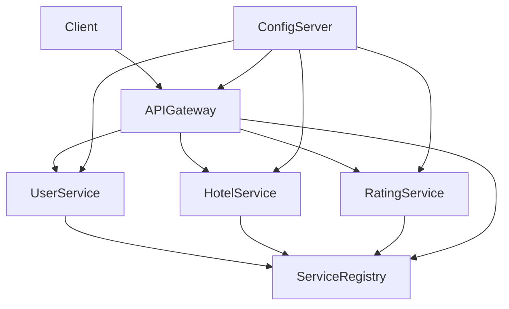

# Microservices Project

This repository contains a **microservices-based backend system** built using **Java and Spring Boot / Spring Cloud**.  
Each service is independently deployable and communicates via REST, using service discovery and centralized configuration.

---

## 🚀 Overview

This project demonstrates a **standard microservices architecture** using:
- API Gateway
- Service Registry (Discovery Server)
- Centralized Configuration
- Multiple domain services

---

## 📌 Microservices Included

| Service Name        | Responsibility |
|---------------------|----------------|
| **ServiceRegistory** | Service discovery and registration |
| **Config-Server**   | Centralized configuration management |
| **ApiGateWay**      | Single entry point for all client requests |
| **UserService**     | User-related operations |
| **HotelService**    | Hotel management |
| **RatingService**   | Ratings management |

---

## 🧠 Architecture


## 🛠️ Prerequisites

Before you start, make sure you have:

- **Java 17+**
- **Maven 3.6+**
- **Docker & Docker Compose** (optional, but highly recommended)
- Environment variables configured for each service if needed

---

## 📦 Setup & Running Locally

### 1. Clone the repository
```sh
git clone https://github.com/kishork18/microservices.git
cd microservices
